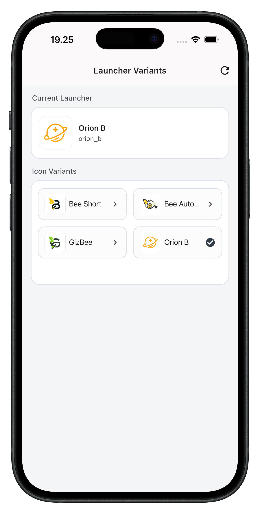
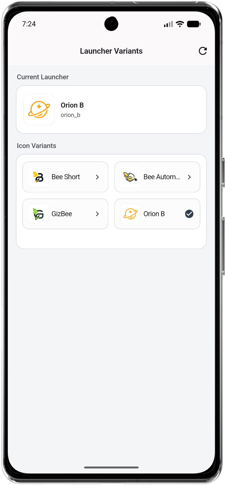
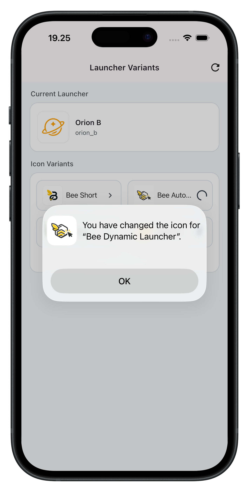

# 🐝 Bee Dynamic Launcher

[](https://pub.dev/packages/bee_dynamic_launcher)
[](https://github.com/dedinopriadi/bee_dynamic_launcher/blob/main/LICENSE)
[](https://flutter.dev)
[](https://github.com/dedinopriadi/bee_dynamic_launcher)

> **JSON-driven launcher icons for Flutter** — change the **home-screen** app icon on **Android** and **iOS** from Dart, and optionally use a **CLI** so your Android and iOS projects stay aligned with the same `catalog.json` and icon assets.

---

**On this page:** [Screenshots](#screenshots) · [Overview](#overview) · [Platform](#platform-support) · [Requirements](#requirements) · [Getting started](#getting-started) · [CLI](#cli-native-sync) · [Android](#android) · [iOS](#ios) · [API](#api-reference) · [Troubleshooting](#troubleshooting)

---

## 🍯 Screenshots

### Demo (GIF)

| iOS | Android |
| --- | --- |
|  |  |

### Launcher Result

| iOS launcher | Android launcher |
| --- | --- |
|  |  |

### iOS System Confirmation



---

## 📖 Overview

| You need                                   | This package provides                                                                                                             |
| ------------------------------------------ | --------------------------------------------------------------------------------------------------------------------------------- |
| Multiple branded / seasonal launcher icons | One `catalog.json` + `ic_<id>.png` masters per variant                                                                            |
| Previews inside Flutter (`Image.asset`)    | `LauncherCatalog` + stable preview asset paths                                                                                    |
| The icon on the **home screen / drawer**   | `BeeDynamicLauncher.applyVariant(id)` via one `MethodChannel`                                                                     |
| Native projects staying in sync            | `dart run bee_dynamic_launcher` (after one-time setup in Android / iOS) — activity aliases, `Info.plist`, mipmaps, asset sets   |

**Two layers — don’t confuse them:**

| Layer           | Mechanism                                 | Use for                             |
| --------------- | ----------------------------------------- | ----------------------------------- |
| **In-app**      | `LauncherCatalog`, `previewIconAssetPath` | Pickers, settings, onboarding       |
| **OS launcher** | `initialize` → `applyVariant`             | What users see **outside** your app |

Persistence of the user’s choice is **not** built in — store `variantId` (e.g. `shared_preferences`) and call `applyVariant` after `initialize` when you need to restore.

**Dependencies:** at runtime, `flutter + this package` only. The CLI’s image tooling runs on your machine when you execute `dart run`; it is not shipped as extra runtime weight in release builds.

---

## ✨ Platform support

|                                                                  | Android  | iOS      |
| ---------------------------------------------------------------- | -------- | -------- |
| Switch home-screen icon                                          | ✅        | ✅        |
| JSON catalog + in-app previews                                   | ✅        | ✅        |
| Variant ids from Dart (`initialize`) — no native hard-coded list | ✅        | ✅        |
| CLI: validate, manifest/plist, resize                            | ✅        | ✅        |
| Remember last choice                                             | Your app | Your app |

**Method channel:** `dev.bee.bee_dynamic_launcher/launcher` — use this package’s registration only; do not add a duplicate channel for the same feature.

---

## 📋 Requirements

- **Flutter** 3.24+ · **Dart** 3.5+
- **Android:** embedding v2
- **iOS:** 12.0+ (`podspec`)

---

## 🚀 Getting started

### 1 · Install

```yaml
dependencies:
  bee_dynamic_launcher: ^1.1.0
```

```yaml
flutter:
  assets:
    - assets/bee_dynamic_launcher/catalog.json
    - assets/bee_dynamic_launcher/icons/
```

```bash
flutter pub get
```

### 2 · Catalog & files

| Path                                            | Role                                                                         |
| ----------------------------------------------- | ---------------------------------------------------------------------------- |
| `assets/bee_dynamic_launcher/catalog.json`      | `id`, `displayName`, `launcherLabel`; optional `primaryVariantId` and per-variant `style` |
| `assets/bee_dynamic_launcher/icons/ic_<id>.png` | Master PNG: **UI previews** + CLI source for mipmaps / Xcode icons           |

```json
{
  "primaryVariantId": "brand_a",
  "variants": [
    {
      "id": "brand_a",
      "displayName": "Brand A",
      "launcherLabel": "My App",
      "style": {
        "baseColor": "#1D4ED8",
        "secondaryColor": "#06B6D4",
        "backgroundColor": "#F8FAFC",
        "surfaceColor": "#FFFFFF"
      }
    },
    {
      "id": "brand_b",
      "displayName": "Brand B",
      "launcherLabel": "My App Alt"
    }
  ]
}
```

`primaryVariantId` must exist in `variants` and matches your default shipped icon.
`style` is optional for each variant. Omitted keys fall back to your app defaults.

### 3 · Initialize native side

Call **before** `getAvailableVariants`, `getCurrentVariant`, or `applyVariant`.

**Recommended:**

```dart
import 'package:bee_dynamic_launcher/bee_dynamic_launcher.dart';

Future<void> setupLauncher() async {
  await BeeDynamicLauncher.initializeFromCatalog();
}
```

**Manual:**

```dart
await LauncherCatalog.instance.loadFromBundle();
final cat = LauncherCatalog.instance;
await BeeDynamicLauncher.initialize(
  variantIds: cat.allIds,
  primaryVariantId: cat.primaryVariantId,
);
```

`initialize` registers variant ids and the **primary** id with Android and iOS (used for default icon naming). You **do not** maintain a second copy of the id list in native code beyond what the CLI generates for manifests and assets.

### 4 · In-app picker (previews)

```dart
import 'package:flutter/material.dart';
import 'package:bee_dynamic_launcher/bee_dynamic_launcher.dart';

Widget buildPickerGrid() {
  final catalog = LauncherCatalog.instance;
  return GridView.builder(
    padding: const EdgeInsets.all(16),
    gridDelegate: const SliverGridDelegateWithFixedCrossAxisCount(
      crossAxisCount: 2,
      crossAxisSpacing: 12,
      mainAxisSpacing: 12,
    ),
    itemCount: catalog.variants.length,
    itemBuilder: (context, i) {
      final e = catalog.variants[i];
      return Column(
        children: [
          Expanded(
            child: ClipRRect(
              borderRadius: BorderRadius.circular(12),
              child: Image.asset(e.previewIconAssetPath, fit: BoxFit.cover),
            ),
          ),
          const SizedBox(height: 8),
          Text(e.displayName, maxLines: 1, overflow: TextOverflow.ellipsis),
        ],
      );
    },
  );
}
```

**Catalog helpers:** `hasVariants`, `variantCount`, `allIds`, `allPreviewIconAssetPaths`, `containsVariant`, `variantEntryFor`, `displayNameFor`, `launcherLabelFor`, `variantStyleFor`.

### 5 · Optional branding style metadata

```dart
const defaultStyle = LauncherVariantStyle(
  baseColor: '#2563EB',
  secondaryColor: '#14B8A6',
  backgroundColor: '#F8FAFC',
  surfaceColor: '#FFFFFF',
);

final styleForBrandB = BeeDynamicLauncher.styleForVariant(
  'brand_b',
  defaultStyle: defaultStyle,
);

final activeStyle = await BeeDynamicLauncher.currentStyle(
  defaultStyle: defaultStyle,
);
```

**Easy one-call path (apply + resolve style):**

```dart
final resolvedStyle = await BeeDynamicLauncher.applyVariantAndGetStyle(
  'brand_b',
  defaultStyle: defaultStyle,
);
```

**Ready-to-use Flutter colors (no manual hex parsing):**

```dart
const defaultColors = LauncherVariantResolvedColors(
  baseColor: Color(0xFF2563EB),
  secondaryColor: Color(0xFF14B8A6),
  backgroundColor: Color(0xFFF8FAFC),
  surfaceColor: Color(0xFFFFFFFF),
);

final resolvedColors = await BeeDynamicLauncher.applyVariantAndGetStyleColors(
  'brand_b',
  defaultColors: defaultColors,
);
```

`LauncherVariantStyle` is Dart-side metadata only; it does not change native
MethodChannel behavior.

Supported color string formats in catalog style:

- `#RRGGBB` (opaque color)
- `#AARRGGBB` (with alpha channel)

### 6 · Apply system launcher icon

```dart
await BeeDynamicLauncher.applyVariant('brand_b');

final String? active = await BeeDynamicLauncher.getCurrentVariant();
final List<String> ids = await BeeDynamicLauncher.getAvailableVariants();
```

### 7 · Full flow (StatefulWidget)

```dart
import 'package:bee_dynamic_launcher/bee_dynamic_launcher.dart';
import 'package:flutter/material.dart';

class LauncherSettingsPage extends StatefulWidget {
  const LauncherSettingsPage({super.key});
  @override
  State<LauncherSettingsPage> createState() => _LauncherSettingsPageState();
}

class _LauncherSettingsPageState extends State<LauncherSettingsPage> {
  bool _ready = false;
  String? _activeId;

  @override
  void initState() {
    super.initState();
    _boot();
  }

  Future<void> _boot() async {
    await BeeDynamicLauncher.initializeFromCatalog();
    final cur = await BeeDynamicLauncher.getCurrentVariant();
    if (!mounted) return;
    setState(() {
      _ready = true;
      _activeId = cur;
    });
  }

  Future<void> _select(String id) async {
    await BeeDynamicLauncher.applyVariant(id);
    final again = await BeeDynamicLauncher.getCurrentVariant();
    if (!mounted) return;
    setState(() => _activeId = again ?? id);
  }

  @override
  Widget build(BuildContext context) {
    if (!_ready) return const Center(child: CircularProgressIndicator());
    final cat = LauncherCatalog.instance;
    return ListView(
      children: [
        for (final e in cat.variants)
          ListTile(
            leading: Image.asset(e.previewIconAssetPath, width: 48, height: 48),
            title: Text(e.displayName),
            subtitle: Text(e.id),
            trailing: _activeId == e.id ? const Icon(Icons.check) : null,
            onTap: () => _select(e.id),
          ),
      ],
    );
  }
}
```

Restore a saved id after cold start: read storage → `initialize` → if `saved != await getCurrentVariant()` then `applyVariant(saved)`.

## 🧰 CLI (native sync)

The CLI ships with this package. After you add `bee_dynamic_launcher` under `dependencies` (see [Getting started](#getting-started)), run it from your **Flutter app root** — the same folder as `pubspec.yaml` and `assets/bee_dynamic_launcher/`:

```bash
dart run bee_dynamic_launcher [flags]
```

**One-time native setup:** Commands that **modify** `AndroidManifest.xml`, `Info.plist`, or `launcher_strings_generated.xml` require the sentinel comments described under [Android](#android) and [iOS](#ios). `--scan` only reads your catalog and icon files. `--icons-only` only regenerates image outputs (no manifest or plist text changes).

| Invocation                           | What it does                                                                              |
| ------------------------------------ | ----------------------------------------------------------------------------------------- |
| *(no arguments)*                     | Validate assets → Android + iOS codegen → mipmaps + iOS icons                             |
| `--help` or `-h`                     | Print usage; no file changes                                                              |
| `--scan`                             | List variant ids from `catalog.json` vs `icons/ic_*.png`; no file changes                 |
| `--scan --strict`                    | Like `--scan`, but **fails** if the two sets differ                                       |
| `--check-android-manifest`           | Check `android/app/src/main/AndroidManifest.xml` launcher config; no writes                |
| `--check-ios-pbxproj`                | Check `ios/Runner.xcodeproj/project.pbxproj` for alternate icon build setting; no writes   |
| `--native-only` or `--skip-icons`    | Codegen strings + manifest alias block + `Info.plist` alternates; **skips** image resize  |
| `--icons-only`                       | Android mipmaps + iOS alternate icon PNGs; **skips** manifest / plist / strings codegen   |
| `--wizard`                           | Interactively append variants to `catalog.json` (stdin); add `ic_<id>.png` then run again |
| `--icons-only` **+** `--native-only` | Error (use one mode at a time)                                                            |

**Examples**

```bash
dart run bee_dynamic_launcher --help
```

```bash
dart run bee_dynamic_launcher --scan
dart run bee_dynamic_launcher --scan --strict
dart run bee_dynamic_launcher --check-android-manifest
dart run bee_dynamic_launcher --check-ios-pbxproj
```

```bash
dart run bee_dynamic_launcher
```

```bash
dart run bee_dynamic_launcher --native-only
dart run bee_dynamic_launcher --skip-icons
```

```bash
dart run bee_dynamic_launcher --icons-only
```

```bash
dart run bee_dynamic_launcher --wizard
```

---

## 🤖 Android

### Where to edit

|                             |                                                                                                                   |
| --------------------------- | ----------------------------------------------------------------------------------------------------------------- |
| **File (your Flutter app)** | `android/app/src/main/AndroidManifest.xml`                                                                        |
| **Scope**                   | Inside the `<application>` element — same file where `<activity android:name=".MainActivity" …>` is declared.      |

### What you add manually (once)

You only add **two HTML comments** as **start/end sentinels**. The CLI will **replace everything between them** with generated `<activity-alias>` blocks on each run.

Put the pair **after** your main `Activity` (`MainActivity`), still inside `<application>`:

```xml
<manifest xmlns:android="http://schemas.android.com/apk/res/android">
    <application
        android:label="…"
        android:icon="…"
        …>
        <activity
            android:name=".MainActivity"
            …>
        </activity>

        <!-- LAUNCHER_ACTIVITY_ALIASES_BEGIN -->
        <!-- LAUNCHER_ACTIVITY_ALIASES_END -->
    </application>
</manifest>
```

- **First time:** the region between `BEGIN` and `END` can be **empty** (only a newline) — then run `dart run bee_dynamic_launcher` from the **app project root** (where `pubspec.yaml` lives).
- **After that:** do not delete the two comment lines; when your catalog changes, run the CLI again so the **middle** is regenerated.
- Aliases use `android:targetActivity=".MainActivity"` — your `MainActivity` must stay the real Flutter entry. Many white-label setups move the **MAIN/LAUNCHER** `intent-filter` from `MainActivity` onto **one** enabled alias only; align with what the codegen outputs for `primaryVariantId`.

### What the CLI updates (same app module)

- Region between the markers (`activity-alias` list).
- `res/values/launcher_strings_generated.xml`
- Legacy mipmaps under `res/mipmap-*/`
- Adaptive icon XML under `res/mipmap-anydpi-v26/` and foreground layers under `res/mipmap-*/`

At runtime, variant **ids** come from Dart (`BeeDynamicLauncher.initialize`); you do not edit a separate hand-maintained list in Kotlin for each variant id.

Quick validation only (no file modification):

```bash
dart run bee_dynamic_launcher --check-android-manifest
```

---

## 🍎 iOS

### Where to edit

|           |                                                                                                                                                                                                     |
| --------- | --------------------------------------------------------------------------------------------------------------------------------------------------------------------------------------------------- |
| **File**  | `ios/Runner/Info.plist`                                                                                                                                                                             |
| **Scope** | Under the root `<dict>` — you need `UIApplicationSupportsAlternateIcons`, and a `CFBundleIcons` → `CFBundleAlternateIcons` dictionary with the markers **inside** `CFBundleAlternateIcons`. |

**Exact placement map (`Info.plist`)**

```text
plist
└── dict (root)
    ├── UIApplicationSupportsAlternateIcons = true
    └── CFBundleIcons (dict)
        ├── CFBundlePrimaryIcon (dict)        # usually already exists
        └── CFBundleAlternateIcons (dict)     # add this if missing
            ├── <!-- LAUNCHER_CFBundleAlternateIcons_BEGIN -->
            └── <!-- LAUNCHER_CFBundleAlternateIcons_END -->
```

Markers must be direct children of `CFBundleAlternateIcons` (not at root level, not outside `CFBundleIcons`).

### What you add manually (once)

1. `UIApplicationSupportsAlternateIcons` must be `true` (if missing, add it next to your other top-level keys).
2. Inside `CFBundleIcons`, ensure there is a `CFBundleAlternateIcons` key whose value is a `<dict>`. Put the **BEGIN/END** comments **inside that inner dict** — the CLI replaces only that region.

Minimal skeleton (if you have **no** alternate icons yet):

```xml
<key>UIApplicationSupportsAlternateIcons</key>
<true/>
<key>CFBundleIcons</key>
<dict>
    <key>CFBundleAlternateIcons</key>
    <dict>
        <!-- LAUNCHER_CFBundleAlternateIcons_BEGIN -->
        <!-- LAUNCHER_CFBundleAlternateIcons_END -->
    </dict>
</dict>
```

If `CFBundleIcons` already exists (e.g. Xcode added `CFBundlePrimaryIcon` for `AppIcon`), **add** `CFBundleAlternateIcons` as a **sibling** key next to `CFBundlePrimaryIcon` — do **not** put the markers outside `CFBundleAlternateIcons`.

```xml
<key>CFBundleIcons</key>
<dict>
    <key>CFBundlePrimaryIcon</key>
    <dict>
        …
    </dict>
    <key>CFBundleAlternateIcons</key>
    <dict>
        <!-- LAUNCHER_CFBundleAlternateIcons_BEGIN -->
        <!-- LAUNCHER_CFBundleAlternateIcons_END -->
    </dict>
</dict>
```

- **First run:** empty region between `BEGIN`/`END` is OK; then `dart run bee_dynamic_launcher` fills alternate icon entries to match your catalog.
- **Primary** icon set stays in `Assets.xcassets` (e.g. `AppIcon`); alternates are generated beside it by the CLI.

### Xcode build setting (required)

Alternate icon sets must be included in the compiled asset catalog. In `Runner.xcodeproj`, each Runner build configuration needs:

```text
ASSETCATALOG_COMPILER_INCLUDE_ALL_APPICON_ASSETS = YES
```

The CLI enforces this automatically when you run:

```bash
dart run bee_dynamic_launcher --native-only
```

Quick validation only (no file modification):

```bash
dart run bee_dynamic_launcher --check-ios-pbxproj
```

If your app uses a custom iOS target/project layout and the CLI cannot patch `project.pbxproj`, set this value manually in Xcode for `Debug`, `Release`, and `Profile`.

**Manual position in Xcode UI**

1. Open `ios/Runner.xcworkspace` in Xcode.
2. Select project navigator item `Runner` (blue icon).
3. Select target `Runner` (under **TARGETS**, not PROJECT).
4. Open **Build Settings** tab.
5. Search for `Include All App Icon Assets`.
6. Set `ASSETCATALOG_COMPILER_INCLUDE_ALL_APPICON_ASSETS` to `YES` for:
   - `Debug`
   - `Release`
   - `Profile`

If you edit raw `project.pbxproj`, place this key in the same `buildSettings` block as `ASSETCATALOG_COMPILER_APPICON_NAME = AppIcon;`.

### Plugin note

Do **not** register a second launcher `MethodChannel` in `AppDelegate` — this package registers it.

---

## 📚 API reference

### `BeeDynamicLauncher`

| Method                                         | Role                                            |
| ---------------------------------------------- | ----------------------------------------------- |
| `initialize({ variantIds, primaryVariantId })` | Register ids + primary on native                |
| `initializeFromCatalog()`                      | `loadFromBundle` + `initialize` (default paths) |
| `getAvailableVariants()`                       | Ids known to native (fallback: catalog)         |
| `getCurrentVariant()`                          | OS-reported id, if any                          |
| `applyVariant(id)`                             | Set launcher icon                               |
| `applyVariantAndGetStyle(id, defaultStyle)`         | Apply launcher icon and return resolved style         |
| `applyVariantAndGetStyleColors(id, defaultColors)`  | Apply launcher icon and return resolved colors        |
| `previewIconAssetPath(id)`                     | Asset path for `Image.asset`                    |
| `styleForVariant(id, defaultStyle)`            | Resolve optional style metadata by id           |
| `currentStyle(defaultStyle)`                   | Resolve optional style for active variant       |
| `styleColorsForVariant(id, defaultColors)`     | Resolve parsed colors by id                     |
| `currentStyleColors(defaultColors)`            | Resolve parsed colors for active variant        |

### `LauncherCatalog.instance`

| API                                           | Role                                |
| --------------------------------------------- | ----------------------------------- |
| `loadFromBundle`                              | Parse JSON from assets              |
| `variants`                                    | `LauncherVariantEntry` list         |
| `allIds` · `primaryVariantId`                 | Shortcuts                           |
| `allPreviewIconAssetPaths`                    | All preview paths                   |
| `hasVariants` · `variantCount`                | Guards                              |
| `containsVariant` · `variantEntryFor`         | Lookup                              |
| `displayNameFor` · `launcherLabelFor`         | Labels                              |
| `variantStyleFor`                             | Optional style metadata             |
| `variantResolvedColorsFor`                    | Optional resolved `Color` values    |

---

## 🔧 Troubleshooting

| Symptom                          | Check                                                                |
| -------------------------------- | -------------------------------------------------------------------- |
| `applyVariant` fails / no effect | Markers + CLI; native resources exist per `id`                       |
| Android shows duplicate app icon | `MainActivity` must not have `MAIN/LAUNCHER` when alias launcher is enabled |
| `Image.asset` error              | `pubspec` lists `icons/`; `ic_<id>.png` for each id                  |
| Empty `getAvailableVariants`     | Run `initialize` after `loadFromBundle`                              |
| iOS shows placeholder icon       | `ASSETCATALOG_COMPILER_INCLUDE_ALL_APPICON_ASSETS = YES` for Runner  |
| Wrong iOS icon                   | `primaryVariantId` matches default set; alternates follow CLI naming |

---

## 📄 License

This project is licensed under the [MIT License](LICENSE).

---

## 🤝 Contributing

For contribution flow and quality checks, see [CONTRIBUTING.md](CONTRIBUTING.md).
Report issues and propose changes on [GitHub](https://github.com/dedinopriadi/bee_dynamic_launcher/issues).

---

### 🐝 Powered by Orion B Project

*"Making coding feel like magic."*